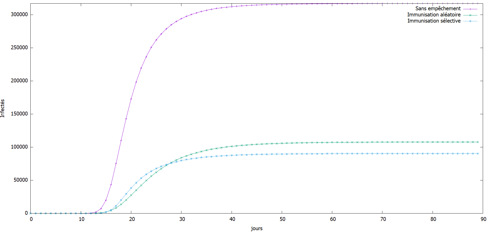
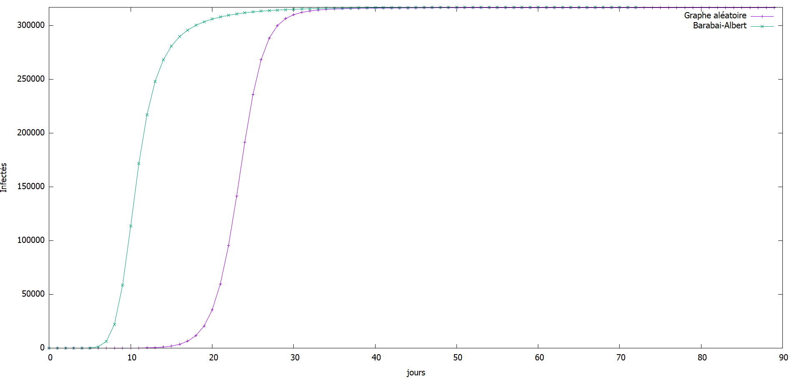
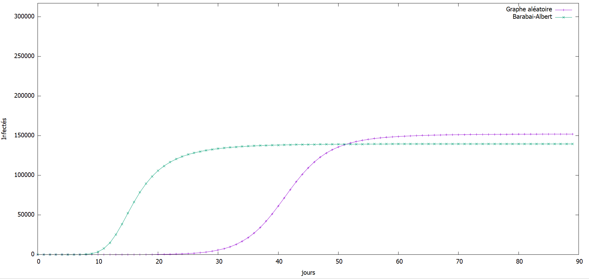
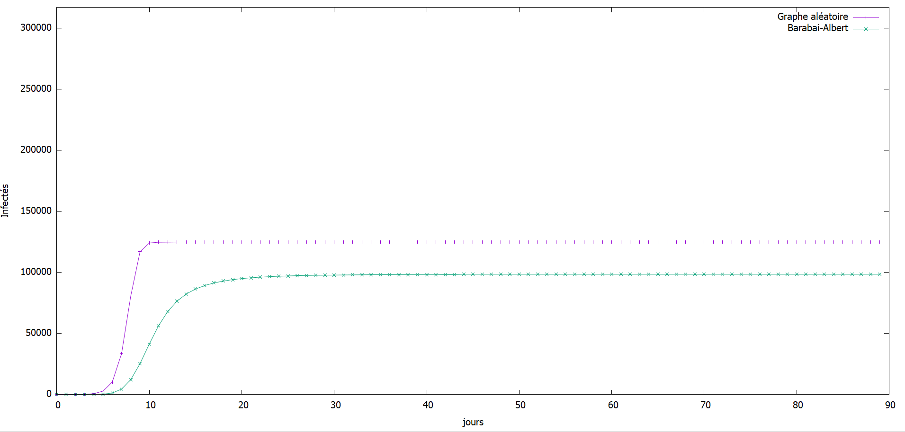

# Tp-Mesures-RI

L’intérêt de cet TP est d’analyser un réseau de collaboration scientifique en informatique.
1-Le téléchargement des données et la lecture est donné dans le code. 

2-Quelques mesures
 
Graph Stream fourni des fonctions permettant de réaliser ses mesures
 avec le getNodeCount() , getEdgeCount() etc ….
-Nombre de nœuds : 317080 
-Nombre de liens : 1049866
-Le degré moyen : 6.62208890914917
-Le coefficient de clustering : 0.6324308280637396
-Le coefficient de clustering pour un réseau aléatoire
 de la même taille et du même degré moyen : 1.9660654912178926E-5.

3-La connexité 

Le Toolkit.isConnected() sur un graph permet de donner sa connexité donc ici
Le réseau est connexe
Un réseau aléatoire de la même taille et du même degré moyen n’est pas connexe.
Un réseau aléatoire avec cette taille devient connexe à partir du degré moyen 
<k> >lnN(p>lnN/N)  (avec N le nombre de nœuds et p la probabilité que deux nœuds soient connectés) 
ce qui va faire que tous les nœuds seront absorbés par la composante géante.

4-Distribution des données

Dans le fichier distributionDegre se trouve le résultat de la distribution 
Oui on observe une ligne droite en log-log. Cette ligne droite en échelle log-log indique que la distribution de degré suit une loi de puissance.

5-Calcul de la distance moyenne 

La distance moyenne dans le réseau est : 6.761602377948783
Oui l’hypothèse des six degrés de séparation se confirme parque le degré moyen du réseau atteint 6.
Oui il s’agit d’un réseau petit monde par ce qu’avec la confirmation de l’hypothèse des six degrés de séparation il y’a la possibilité que chaque nœud puisse être relié a n’importe quel autre nœud du réseau. 
La distance moyenne dans le réseau aléatoire de même caractéristique est : 6.698564297731546.

6-Réseau aléatoire et Réseau Barabasi-Albert

Avec le même nombre de nœuds et degré moyen précédemment calculer on obtient :
- Nombre de Nœuds du réseau aléatoire : 317087
- Nombre de Nœuds du réseau Barabasi-Albert : 317082
- Nombre de Liens du réseau aléatoire : 1049811
- Nombre de Liens du réseau Barabasi-Albert : 1109815
- Le degré moyen du réseau aléatoire : 6.621595859527588
- Le degré moyen du réseau Barabasi-Albert : 7.000176429748535
- Le coefficient de clustering du réseau aléatoire : 2.161832416620533E-5
- Le coefficient de clustering du réseau Barabasi-Albert : 4.2443198351383473E-4
- Le réseau aléatoire n’est pas connexe.
- Le réseau Barabasi-Albert est connexe.
- La distance moyenne dans le réseau aléatoire est : 6.700887426332674
- La distance moyenne dans le réseau de Barabasi-Albert est : 4.988951543219359
 Les résultats expérimentaux ne correspondent pas aux prédictions théoriques.
on remarque que le degré moyen est plus elevé dans le reseau Barabasi-Albert par ce que dans ce type de reseau les noeuds qui ont un degré plus important recevoivent plus de liens.
Contrairement au réseau aleatoire les deux autres sont connexes.

Propagation
 Le seuil épidémique par définition est lambda = beta/mu
beta =1/7 un individu envoie en moyenne un mail par semaine à chacun de ses collabora-teurs
mu =1/14 un individu met à jour son anti-virus en moyenne deux fois par mois(Pour 1 mois =28 jours)
- Taux de propagation = 2.0
- - Le seuil épidémique du réseau de collaboration est : 0.04598472436222584
- Le seuil épidémique du réseau aléatoire est : 0.13124949621603624
  

On remarque que la courbe de l’immunisation sélective est en bas des deux autres
donc a moins de cas d’infection que les deux autres méthodes

-1er Cas on ne fait rien pour empêcher l'épidémie
 - 316645/317087 infectés pour le réseau aléatoire
 - 317082/317082 infectés pour le réseau Barabasi-albert
   

-2e Cas Immunisation aléatoire
 - 151958/317082 infectés pour le réseau aléatoire
 - Le seuil épidémique du réseau avec stratégies d'immunisation aléatoire est : 0.2243705316895631
 - 139607/317082 infectés pour le réseau Barabasi-albert
 - Le seuil épidémique du réseau avec stratégies d'immunisation aléatoire est : 0.0596716106803383

-3e cas Immunisation sélective

On remarque un problème lorsqu'on génère un graphe aléatoire de taille 317082 
avec un dégré moyen égale à 6, tous les noeuds ne sont pas liés et la méthode d'immunisation 
selective rencontre quelques problèmes d'exception.
donc ici, on par avec un graphe aléatoire avec un dégré moyen de 50 et un graphe de barabasi avec 
un degré moyen de 6 (dégré moyen du premmier graphe)

- 124736/317131 infectés pour le réseau aléatoire
- Le seuil épidémique du réseau avec stratégies d'immunisation sélective est : 0.032536494292978474
- 98442/173989 infectés pour le réseau BBA
- Le seuil épidémique du réseau avec stratégies d'immunisation sélective est : 0.24718842671967695

On remarque d’après analyse des trois cas de figure que le cas d’immunisation sélective est à une
courbe plus intéressante (elles croient moins que les deux autres donc moins d’infections )

Conclusion 

Ce TP m’a permis de me familiariser avec les outils nécessaires à la programmation de réseau (aléatoire et Barabasi-Albert) et de voir les quelques différences qui peuvent exister. 
A Noté que l’exécution du programme peut prendre du temps. Mieux faut exécuter petit à petit pour aller plus vite.

